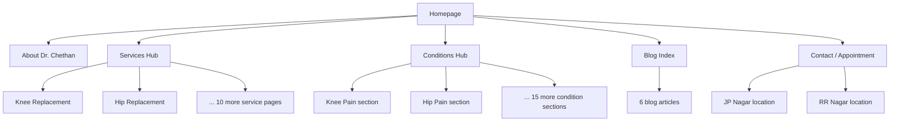

# Dr. Chethan Kumar Website — Prompt Review & Build Plan

> **Project root:** `viksha_clinic_website/` (sister folder to `viksha_clinic`)
> **Stack:** Plain HTML5, CSS3, minimal vanilla JavaScript
> **Content:** Partial real content + placeholders where needed

---

## Prompt Review: What's Already Strong

The draft prompt (see [`website_builing_prompt.md`](../website_builing_prompt.md)) is **~80% build-ready**. It clearly defines:

- **Brand direction** — premium hospital aesthetic, navy/teal palette, glassmorphism, sticky nav, WhatsApp CTA
- **Core pages** — hero, about, 12 service pages, conditions, trust, appointment, FAQ, blog, contact
- **SEO strategy** — local keywords, schema markup, meta tags, FAQ schema, breadcrumbs
- **Content structure per service page** — symptoms, causes, diagnosis, treatment, FAQs, recovery, CTA
- **Conversion goals** — appointment form, call, WhatsApp, maps

This is enough to start building a credible v1 site.

---

## Gaps & Recommended Additions to the Prompt

### Critical (add before build)

| Gap | Why it matters | Suggested addition to prompt |
|-----|----------------|------------------------------|
| **Real contact details** | CTAs, schema, footer, WhatsApp all depend on this | Provide: phone, WhatsApp number, email, both clinic addresses (JP Nagar + RR Nagar), clinic timings per location |
| **Doctor credentials** | Trust + Physician schema | MBBS/MS/DNB, fellowships, years of experience, hospital affiliations, professional memberships (e.g. IOA) |
| **Two-clinic model** | IA and local SEO depend on this | Clarify: same doctor at 2 locations? Separate location pages? Different hours per clinic? |
| **Appointment form fields** | Form UX + backend | Name, phone, email, preferred location, service/condition, preferred date/time, message |
| **Form submission method** | No backend specified | Options: `mailto:`, Formspree/Netlify Forms, or WhatsApp deep-link with pre-filled message |
| **Medical disclaimer** | Legal/trust for healthcare sites | "Content is educational, not a substitute for consultation" + emergency guidance |
| **Privacy policy** | Required if collecting patient data via form | Short privacy page for form data handling |

### Important (improves quality & SEO)

| Gap | Suggested addition |
|-----|-------------------|
| **Information architecture** | Define nav: Home, About, Services (dropdown), Conditions (hub page or grouped), Blog, Contact. Avoid 29 top-level links. |
| **Services vs Conditions overlap** | Services = procedures (Knee Replacement); Conditions = symptoms/diagnoses (Knee Pain). Link them bidirectionally. |
| **Credentials & affiliations section** | Degrees, fellowships, hospitals where he operates, awards |
| **Consultation fees / insurance** | Optional but high-converting: "Consultation fee", "Insurance/TPA accepted" |
| **Image assets** | Specify: hero photo, clinic photos, doctor headshot, service icons. Placeholder strategy if missing. |
| **Google Reviews** | Real embed (Google Business widget) vs static carousel with placeholder quotes |
| **Before/after stories** | Medical ethics: use anonymized mobility improvement stories, not clinical before/after images unless approved |
| **Blog scope** | "6 full articles" vs "6 templates with outline" — specify word count (~800–1200 words each) |
| **Domain & site name** | e.g. `dr-chethankumar.com` or `vikshaclinic.com` |
| **Accessibility** | WCAG basics: contrast, keyboard nav, focus states, semantic HTML |
| **Performance budget** | Hero image max size, lazy-load below fold, minimal JS for Core Web Vitals |

### Nice-to-have (post-v1)

- Kannada language toggle (strong for Bengaluru local SEO)
- Online payment / Razorpay for consultation deposit
- Patient education video section
- Sitemap.xml + robots.txt (included in v1 for SEO)
- Open Graph / Twitter cards for social sharing
- 404 page with appointment CTA

---

## Suggested Prompt Addendum (copy into build prompt)

```text
Technical Stack
- Plain HTML5, CSS3, minimal vanilla JavaScript (no framework).
- Mobile-first responsive design. Semantic HTML for SEO.
- Deploy-ready static files. Include sitemap.xml and robots.txt.

Clinic Details (fill in real values)
- Clinic 1: [Name], JP Nagar — [full address], [timings], [Google Maps embed URL]
- Clinic 2: [Name], RR Nagar — [full address], [timings], [Google Maps embed URL]
- Phone: [number] | WhatsApp: [number] | Email: [email]

Doctor Profile
- Qualifications: [MBBS, MS Ortho, Fellowship...]
- Experience: [X years] | Surgeries: [X]+ | Patients: [X]+
- Affiliations: [hospitals/clinics]
- Professional photo: [path or placeholder]

Navigation Structure
- Sticky header: Home | About | Services ▾ | Conditions | Blog | Book Appointment
- Services: 12 dedicated pages (linked from dropdown)
- Conditions: single hub page with 17 condition sections + anchor links
- Footer: contact, locations, quick links, social, disclaimer

Appointment Form
- Fields: name, phone, email, location (JP Nagar / RR Nagar), service, preferred date, message
- Submit via: [Formspree ID / WhatsApp deep link / mailto]
- Success message + fallback call/WhatsApp buttons

Legal
- Medical disclaimer in footer
- Privacy policy page (linked from form)
- No guaranteed outcomes in testimonials

Performance & SEO
- Compress images (WebP where possible), lazy-load images
- Unique <title> and meta description per page (<60 char titles)
- JSON-LD: Physician, MedicalBusiness (per location), FAQPage, BreadcrumbList
- Alt text on all images with natural keywords
```

---

## Site Architecture



**Recommended page count for v1:** ~25 HTML files

- 1 homepage
- 1 about
- 12 service pages
- 1 conditions hub (17 SEO sections with anchor IDs)
- 1 blog index + 6 blog posts
- 1 contact/appointment
- 1 privacy policy
- 1 sitemap (XML)

---

## File Structure (Plain HTML/CSS/JS)

```
viksha_clinic_website/
├── index.html
├── about.html
├── contact.html
├── privacy.html
├── services/
│   ├── index.html
│   ├── knee-replacement.html
│   ├── hip-replacement.html
│   └── ... (10 more)
├── conditions/
│   └── index.html          # 17 condition sections
├── blog/
│   ├── index.html
│   └── *.html              # 6 articles
├── assets/
│   ├── css/
│   │   ├── main.css        # variables, typography, layout
│   │   ├── components.css  # cards, nav, buttons, glassmorphism
│   │   └── animations.css  # subtle scroll/hover animations
│   ├── js/
│   │   ├── main.js         # nav, sticky header, mobile menu
│   │   ├── carousel.js     # reviews carousel
│   │   └── form.js         # appointment form handling
│   └── images/
│       ├── hero/
│       ├── doctor/
│       └── icons/
├── sitemap.xml
├── robots.txt
├── PLAN.md
├── website_builing_prompt.md
└── README.md
```

---

## Design System

| Token | Value |
|-------|-------|
| Primary | Navy `#0A2540` or `#1B2A4A` |
| Accent | Teal `#0D9488` or `#14B8A6` |
| Background | White `#FFFFFF`, off-white `#F8FAFC` |
| Typography | Headings: `Playfair Display` or `DM Serif`; Body: `Inter` or `DM Sans` |
| Cards | Glassmorphism: `backdrop-filter: blur(12px)`, subtle border, soft shadow |
| CTA | Teal primary button; navy outline secondary |
| Floating WhatsApp | Fixed bottom-right, green `#25D366` |

---

## Build Phases

### Phase 1 — Foundation

- [x] Set up file structure, shared CSS variables, reusable header/footer
- [x] Build homepage: hero, about teaser, services grid, trust section, FAQ accordion, appointment CTA, footer
- [x] Implement sticky nav, mobile hamburger, floating WhatsApp button

### Phase 2 — Content Pages

- [x] About page with full doctor profile (placeholders where content missing)
- [x] 12 service pages from a shared template (symptoms → CTA structure)
- [x] Conditions hub page with 17 SEO-rich sections
- [x] Contact page: form, maps (2 locations), timings, call/WhatsApp buttons

### Phase 3 — SEO & Trust

- [x] Unique meta titles/descriptions per page
- [x] JSON-LD schema (Physician, LocalBusiness x2, FAQPage on homepage)
- [x] Breadcrumbs on inner pages
- [x] Google Reviews carousel (static placeholders until real reviews provided)
- [x] 20 FAQs on homepage + FAQ schema (schema currently includes a subset; expand if needed)
- [x] sitemap.xml, robots.txt, image alt tags

### Phase 4 — Blog & Polish

- [x] Blog index + 6 SEO articles (shorter first drafts; expand toward 800–1200 words)
- [x] Subtle scroll animations (CSS + IntersectionObserver, no heavy libraries)
- [x] Performance pass: image compression, lazy loading (minify optional)
- [ ] Cross-browser and mobile testing

---

## Content Checklist (partial — rest as placeholders)

| Item | Status |
|------|--------|
| Doctor professional photo | Placeholder if missing |
| Clinic names & full addresses (JP Nagar, RR Nagar) | **Needed for maps/schema** |
| Phone & WhatsApp numbers | **Needed for CTAs** |
| Email | **Needed for form/footer** |
| Clinic timings per location | **Needed for contact page** |
| Qualifications & experience stats | Partial OK — refine later |
| Google Maps embed URLs | **Needed for contact** |
| Social media links | Optional placeholders |
| Real Google reviews | Placeholder carousel until available |
| Domain name | Decide before final schema URLs |

---

## Verdict on the Prompt

**Clear enough to build?** Yes, with the additions above — especially clinic details, form handling, nav structure, and legal disclaimers.

**Biggest risks if unchanged:**

1. Thin/duplicate SEO pages (29 separate condition + service pages without linking strategy)
2. Missing real contact data breaks conversion and LocalBusiness schema
3. Medical content liability without disclaimer
4. "Before/after" imagery without patient consent

**Recommended approach:** Build v1 as specified, use a **conditions hub page** (not 17 separate pages) to avoid thin content penalties, and use **placeholder content** clearly marked for sections awaiting real data from Dr. Chethan.
